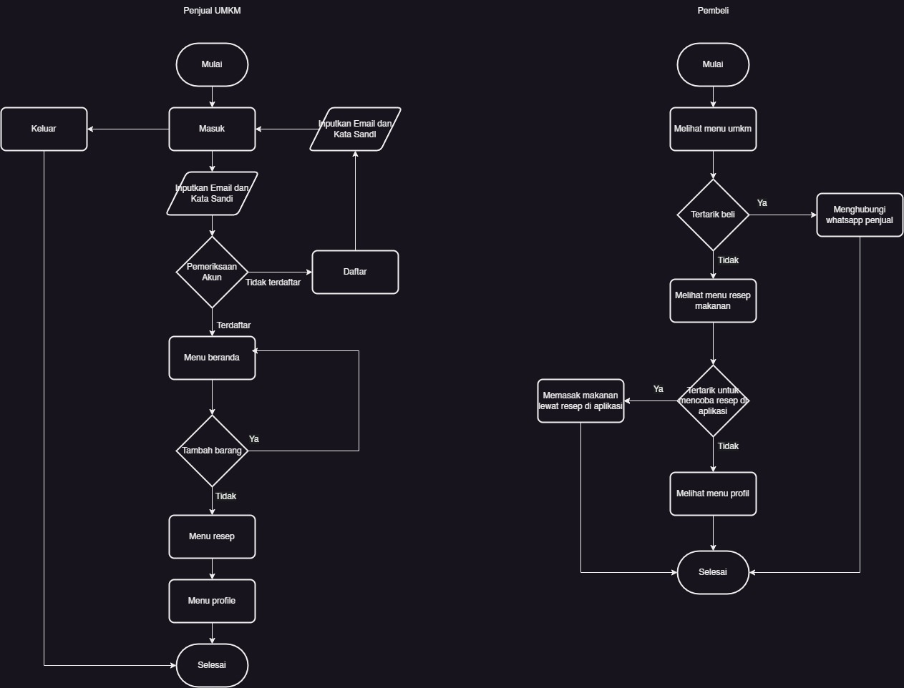

# Rukalo UMKM

# Background
Dalam dunia perekonomian, teknologi informasi dimanfaatkan untuk meningkatan angka penjualan di Indonesia. Indonesia merupakan salah satu negara dengan jumlah ekonomi terbesar di Asia Tenggara. Salah satu sektor yang berpengaruh besar dalam peningkatan ekonomi di Indonesia ialah sektor Usaha Mikro, Kecil, dan Menengah (UMKM). Desa Palasari Girang adalah salah satu desa yang terletak di Kecamatan Kalapanunggal, Kabupaten Sukabumi yang memiliki luas wilayah 336 Ha dengan jumlah 2595 kepala keluarga, 7804 orang penduduk dan 6 kedususan. Karena wilayah yang dimiliki desa ini cukup luas menjadikannya sebagai salah satu desa yang memiliki sumber daya alam yang melimpah. Kesulitan dan permasalahan yang kerap muncul dan dialami oleh desa ini adalah kurangnya kesadaran akan pentingnya pemanfaatan teknologi, sebagai contohnya masih banyak pelaku UMKM yang memasarkan produknya melalui mulut ke mulut, hal itu disebabkan karena kurangnya edukasi tentang pemasaran online, pendataan UMKM yang masih manual, ditambah dengan keterbatasan teknologi yang dimiliki oleh desa untuk mendukung pemasaran UMKM setempat. Sehingga dampak yang terjadi ialah UMKM di desa ini kalah saing dalam segi pemasaran, penyebaran produk yang tidak merata, pengelolaan data UMKM yang tidak efektif.
# Description
Rukalo adalah sebuah aplikasi inovatif yang dirancang untuk mendukung pengembangan usaha mikro, kecil, dan menengah (UMKM) di Desa Palasari Girang. Nama Rukalo merupakan kependekan dari "Ragam Unggulan UMKM Desa Palasari Girang". Aplikasi ini hadir sebagai solusi digital yang bertujuan untuk mempromosikan produk-produk UMKM lokal, menyediakan media pendataan UMKM bagi pemerintah desa, serta menjadi platform penjualan bagi UMKM setempat.
# Member
- M. Herdi Al-Fachri - Universitas Muhammadiyah Sukabumi
- Rafida Zahra Mahirani - Universitas Muhammadiyah Sukabumi
# Technology
- Kotlin
- XML
- AndroidX Navigation
- Glide Library
- Firebase Realtime Database
- Firebase Authentication
- Firebase Storage
#Tools & IDE
- Canva
- Figma
- Android Studio
- Draw io
- Google Font
- Firebase
- Git
# UI/UX

# Flowchart

